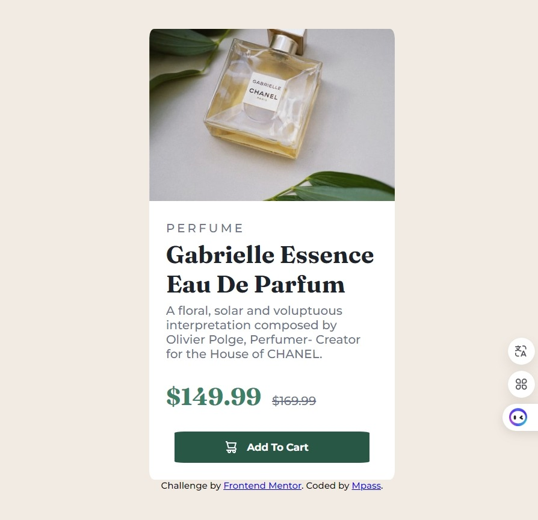

## Table of contents

- [Overview](#overview)
  - [The challenge](#the-challenge)
  - [Screenshot](#screenshot)
  - [Links](#links)
- [My process](#my-process)
  - [Built with](#built-with)
  - [What I learned](#what-i-learned)
  - [Continued development](#continued-development)
  - [Useful resources](#useful-resources)
- [Author](#author)

## Overview

### The challenge

Users should be able to:

- View the optimal layout depending on their device's screen size
- See hover and focus states for interactive elements

### Screenshot

-Desktop

-Mobile

-hover

### Links

- Solution URL: [https://github.com/Benson0721/react_product_preview_component]
- Live Site URL: [https://benson0721.github.io/react-preview-card/]

## My process

### Built with

- Semantic HTML5 markup
- CSS custom properties
- Flexbox
- Scss
- Postcss 
- Mobile-first workflow
- [React](https://reactjs.org/) - JS library

### What I learned
It cost a lot of time to get used to react,but I think next time I can do it more faster and accurate.
Beside that, I encounter some challenge for deploy vite+react project to the github pages,
system keep telling me that I have some unexpect error (spawn ENAMETOOLONG) and I really don't know how to deal with that!
I search for many infofmation and ask AI, and I finally figure out the solution!
I use .sh to help me deploy website, and it really pleasure to see my work finally could be seen on github! 

### Continued development

I want to get more familiar with react, so I will keep practise that in the futrue practise!

### Useful resources

- [https://ithelp.ithome.com.tw/m/articles/10303608] - This helped me for understanding deploy website on github.
- [https://www.npmjs.com/package/gh-pages](https://www.example.com) - This is gh-pages doc,a tool can help me deploy website on github

## Author

- Github - [Mpass](https://github.com/Benson0721)
- Frontend Mentor - [@Mpass](https://www.frontendmentor.io/profile/Benson0721)

